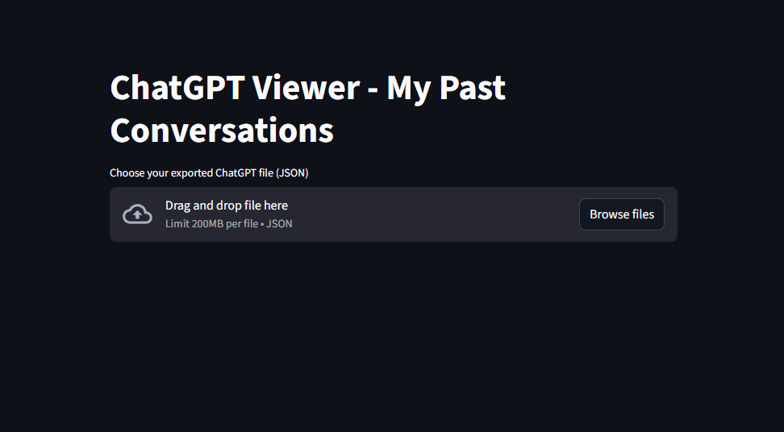

# ChatGPT Viewer

[](https://chatgptviewer.streamlit.app/)

[Live demo](https://chatgptviewer.streamlit.app/)

A lightweight Streamlit app to browse and export your past ChatGPT conversations from the official data export JSON.

## Overview

- Upload your ChatGPT export JSON (the `conversations.json` file from the export bundle)
- Browse conversation messages with a clean left/right layout
  - You (right-aligned, dark bubble)
  - ChatGPT (left-aligned)
- Search by keyword with highlighted matches
- Export the selected conversation to a Markdown file

> Notes
> - This app runs locally in your browser using Streamlit.
> - It does not send your data anywhere.

## Features

- Upload `.json` file exported from ChatGPT
- Conversation list with titles and creation time
- Inline keyword highlighting using `<mark>`
- One-click export to Markdown (per conversation)

## Requirements

- Python 3.8+
- Streamlit

You can install Streamlit via pip:

```pwsh
# From the project folder
python -m venv .venv
.\.venv\Scripts\Activate.ps1
pip install streamlit
```

If you already have an environment, just `pip install streamlit` in it.

## Run the app

```pwsh
# From the project folder
.\.venv\Scripts\Activate.ps1  # if you created the venv above
streamlit run app.py
```

Your browser will open automatically (or visit the URL shown in the terminal, typically http://localhost:8501).

## Deploy to Streamlit Community Cloud

You can deploy this app in minutes:

1. Push this repo to GitHub (public or private).
2. Go to https://streamlit.io/ and connect your GitHub account.
3. Create a new app and select this repository and the `main` branch.
4. App file path: `app.py`.
5. Ensure `requirements.txt` is present (this repo includes `streamlit`).

Optional:
- Pin a Python version using `runtime.txt` (e.g., `python-3.11`).
- Customize theme via `.streamlit/config.toml`.

Notes on Cloud:
- Large uploads may be limited; if the JSON is very large, consider pre-filtering locally.
- App restarts when idle; your uploaded file isn’t persisted between sessions.

## Usage

1. Click “Choose your exported ChatGPT file (JSON)” and select the `conversations.json` file from your ChatGPT data export.
2. Pick a conversation in the “Select a conversation” dropdown.
3. (Optional) Type a keyword in “Search by keyword (optional)” to highlight matches.
4. Click “Export conversation to Markdown” to download the `.md` file for the current conversation.

## Screenshots

Add a screenshot to showcase the UI:

```
chatgpt_viewer/
└─ docs/
  └─ screenshot.png
```

Then reference it here:



## Expected JSON format

The app expects the structure used by ChatGPT exports: a list of conversation objects that contain a `mapping` of messages. A minimal example:

```json
[
  {
    "title": "Example title",
    "create_time": 1700000000,
    "mapping": {
      "id1": {
        "message": {
          "author": { "role": "user" },
          "content": { "parts": ["Hello"] }
        }
      },
      "id2": {
        "message": {
          "author": { "role": "assistant" },
          "content": { "parts": ["Hi!"] }
        }
      }
    }
  }
]
```

Important details:
- Messages must have `author.role` ("user" or "assistant")
- Message text is read from `message.content.parts` (array of strings)
- Titles are displayed from `conversation.title` (falls back to "Untitled")

## Troubleshooting

- “Error reading JSON. Please check the file.”
  - Ensure you selected the ChatGPT export `conversations.json`, not another file.
  - Validate that the JSON is well-formed (no trailing commas, correct quotes, etc.).
- “This conversation has no messages.”
  - The selected conversation may be empty or the `mapping` is missing messages.
- Highlighting doesn’t appear
  - Only exact (case-insensitive) matches are highlighted within message text.

Cloud-specific tips:
- If the app can’t start on Streamlit Cloud, verify `requirements.txt` is committed and `app.py` is the entry point.
- For very large JSON files, try reducing the file size or splitting exports.

## Project structure

```
chatgpt_viewer/
├─ app.py        # Streamlit app
├─ requirements.txt  # Python dependencies (for Streamlit Cloud and local installs)
├─ runtime.txt   # Pin Python version for Streamlit Cloud (e.g., python-3.11)
└─ .streamlit/
  └─ config.toml    # Theme configuration
README.md        # This file
```

## Development notes

- Single-file Streamlit app (`app.py`)
- UI language: English
- Right alignment for “You”, left for “ChatGPT”
- Markdown export uses the conversation title, falling back to `conversation.md`

## License

No license specified. If you intend to open-source this project, consider adding a `LICENSE` file (e.g., MIT).

## Acknowledgements

- Built with [Streamlit](https://streamlit.io/)
